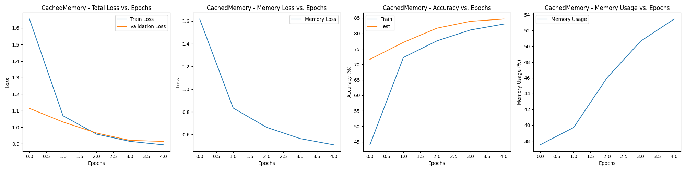
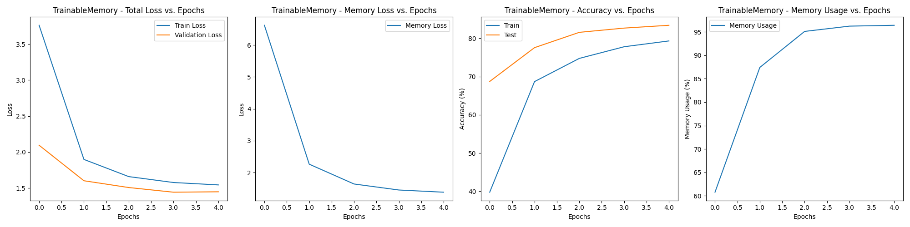

# 🧠 Memory-Enhanced Neural Network with Cached and Trainable Memory Modules 🔄

## 📊 Overview

This repository contains a PyTorch implementation of a neural network architecture that incorporates trainable memory modules. The architecture enhances standard neural networks by adding memory components that can retrieve and store feature representations, leading to improvements in both accuracy and inference speed for certain types of inputs.

## 🏗️ Architecture

### 🔩 Core Components

1. **Memory Modules**:
   - **TrainableMemory**: A fully differentiable memory module with learnable parameters
   - **CachedMemory**: A simplified memory module that directly stores feature vectors

2. **EnhancedClassifier**: A wrapper that combines a traditional neural network with either memory module.

### ⚙️ How It Works

The system operates with a dual-path architecture:

```
                      ┌─► Memory Retrieval ─┐
                      │                     │
Input ─► Backbone ─► Features               ├─► Final Prediction
                      │                     │
                      └─► Neural Network ───┘
```

During inference:
1. Features are extracted from the input using the backbone network
2. The memory module retrieves the most similar stored item and its confidence score
3. If the confidence exceeds a threshold, the memory prediction is used
4. Otherwise, the neural network prediction is used

## 💾 Memory Module Details

### TrainableMemory

The `TrainableMemory` class implements a fully differentiable memory module with learnable parameters:

```
┌───────────────────────────────────────────────────────────────────────────────┐
│                         TRAINABLE MEMORY MODULE                               │
├───────────────────────────────────────────────────────────────────────────────┤
│                                                                               │
│  ┌─────────────────────┐                                                      │
│  │ LEARNABLE PARAMETERS│                                                      │
│  │ ┌───────────────┐   │  ┌─────────────────────────┐                         │
│  │ │ Memory Keys   │◄──┼──┤                         │                         │
│  │ │ [M×feature_dim]   │  │                         │                         │
│  │ └───────────────┘   │  │                         │                         │
│  │ ┌───────────────┐   │  │                         │  ┌─────────────────┐    │
│  │ │ Memory Values │◄──┼──┤   SIMILARITY COMPUTE    │  │  CONFIDENCE     │    │
│  │ │ [M×num_classes]   │  │   (Cosine Distance)     │◄─┤  THRESHOLDING   │◄───┼─ Query
│  │ └───────────────┘   │  │                         │  │                 │    │  Features
│  └─────────────────────┘  │                         │  └─────────────────┘    │
│                           │                         │           │             │
│                           │                         │           │             │
│                           │                         │           ▼             │
│                           └─────────────────────────┘    ┌─────────────────┐  │
│                                     │                    │ Class Prediction │  │
│                                     │                    │ & Confidence     │  │
│                                     │                    └─────────────────┘  │
│                                     ▼                                         │
│                           ┌─────────────────────────┐                         │
│                           │ MEMORY CONTRASTIVE LOSS │                         │
│                           │ COMPUTATION             │                         │
│                           └─────────────────────────┘                         │
│                                     │                                         │
│                                     ▼                                         │
│                              Loss for Training                                │
│                                                                               │
├───────────────────────────────────────────────────────────────────────────────┤
│                            MEMORY OPERATIONS                                  │
├───────────────────────────────────────────────────────────────────────────────┤
│                                                                               │
│  ┌─────────────────┐     ┌──────────────────────────┐     ┌─────────────────┐ │
│  │     RETRIEVE    │     │        UPDATE            │     │   CONTRASTIVE   │ │
│  │                 │     │                          │     │   LOSS COMPUTE  │ │
│  │ 1. Normalize    │     │ 1. Check if memory full  │     │                 │ │
│  │    features     │     │ 2. If not full:          │     │ 1. Match query  │ │
│  │ 2. Calculate    │     │    - Add to unused slots │     │    with memory  │ │
│  │    similarity   │     │ 3. If full:              │     │ 2. Create pos/  │ │
│  │ 3. Find nearest │     │    - Check similarity    │     │    neg masks    │ │
│  │    neighbors    │     │    - Replace low         │     │ 3. Apply temp-  │ │
│  │ 4. Return class │     │      confidence items    │     │    scaled       │ │
│  │    + confidence │     │                          │     │    softmax      │ │
│  └─────────────────┘     └──────────────────────────┘     └─────────────────┘ │
│                                                                               │
└───────────────────────────────────────────────────────────────────────────────┘
```

#### Key Features:
- Uses learnable parameters for memory keys and values
- Memory keys store feature representations
- Memory values store one-hot encoded class distributions
- Fully differentiable for end-to-end training
- Dynamic memory management that replaces low-confidence items when full

### CachedMemory

The `CachedMemory` class implements a simpler, non-parametric memory module:

```
┌───────────────────────────────────────────────────────────────────────────────┐
│                          CACHED MEMORY MODULE                                 │
├───────────────────────────────────────────────────────────────────────────────┤
│                                                                               │
│  ┌─────────────────────┐                                                      │
│  │ DIRECT STORAGE      │                                                      │
│  │ ┌───────────────┐   │  ┌─────────────────────────┐                         │
│  │ │ Memory Keys   │◄──┼──┤                         │                         │
│  │ │ [stored features] │  │                         │                         │
│  │ └───────────────┘   │  │                         │                         │
│  │ ┌───────────────┐   │  │                         │  ┌─────────────────┐    │
│  │ │ Memory Values │◄──┼──┤   SIMILARITY COMPUTE    │  │  CONFIDENCE     │    │
│  │ │ [class labels]    │  │   (Cosine Distance)     │◄─┤  THRESHOLDING   │◄───┼─ Query
│  │ └───────────────┘   │  │                         │  │                 │    │  Features
│  └─────────────────────┘  │                         │  └─────────────────┘    │
│                           │                         │           │             │
│                           │                         │           │             │
│                           │                         │           ▼             │
│                           └─────────────────────────┘    ┌─────────────────┐  │
│                                                          │ Class Prediction │  │
│                                                          │ & Confidence     │  │
│                                                          └─────────────────┘  │
│                                                                               │
├───────────────────────────────────────────────────────────────────────────────┤
│                            MEMORY OPERATIONS                                  │
├───────────────────────────────────────────────────────────────────────────────┤
│                                                                               │
│  ┌─────────────────┐     ┌──────────────────────────┐     ┌─────────────────┐ │
│  │     RETRIEVE    │     │        UPDATE            │     │   CONTRASTIVE   │ │
│  │                 │     │                          │     │   LOSS COMPUTE  │ │
│  │ 1. Normalize    │     │ 1. Check if memory full  │     │                 │ │
│  │    features     │     │ 2. If not full:          │     │ 1. Match query  │ │
│  │ 2. Calculate    │     │    - Directly store new  │     │    with memory  │ │
│  │    similarity   │     │      features & labels   │     │ 2. Create pos/  │ │
│  │ 3. Find nearest │     │ 3. If full:              │     │    neg masks    │ │
│  │    neighbors    │     │    - Check similarity    │     │ 3. Handle edge  │ │
│  │ 4. Return class │     │    - Replace same-class  │     │    cases for    │ │
│  │    + confidence │     │      or lowest similarity│     │    batch size   │ │
│  └─────────────────┘     └──────────────────────────┘     └─────────────────┘ │
│                                                                               │
└───────────────────────────────────────────────────────────────────────────────┘
```

#### Key Features:
- Directly stores feature vectors and class labels
- Non-parametric approach (no learnable parameters)
- Uses direct similarity comparison
- Intelligent replacement strategy when memory is full
- Prioritizes replacing items of the same class when possible

### Key Differences Between Memory Implementations

| Feature | TrainableMemory | CachedMemory |
|---------|-----------------|--------------|
| Parameters | Learnable memory keys and values | Direct storage (no parameters) |
| Storage Format | Keys: Features, Values: One-hot encoded classes | Keys: Features, Values: Class labels |
| Differentiability | Fully differentiable | Non-differentiable storage |
| Memory Management | Replaces least confident items | Prioritizes same-class replacement |
| Training | Optimizes memory contents via backprop | Only stores examples, no optimization |
| Use Case | When end-to-end training is needed | When direct storage is sufficient |

## 🔁 Training Process

The system is trained using a combination of:

1. **Classification Loss**: Standard cross-entropy loss for neural network predictions.
2. **Memory Contrastive Loss**: Encourages clustering of features from the same class in the embedding space.

The training process:
1. Computes features for each input batch
2. Calculates both classification and memory contrastive losses
3. Updates model parameters through backpropagation
4. Updates the memory module with new feature-label pairs

## ⚡ Dynamic Memory Management

Both memory implementations include sophisticated memory management:

1. **Initial Filling**: When memory is not full, new examples are added directly
2. **Replacement Strategy**: Once memory is full:
   - For each new example, similarity with all memory items is calculated
   - If similarity is below threshold (indicating a novel example):
     - **TrainableMemory**: Replaces the least confident memory item
     - **CachedMemory**: First tries to replace an item of the same class with lowest similarity, then the overall lowest similarity item

This dynamic approach ensures that memory maintains high-quality examples and can adapt to new patterns over time.

## ⚡ Inference and Speed Advantages

The dual-path architecture offers a significant speed advantage:

- **Memory Path**: Fast lookup that only requires computing feature similarity
- **Neural Network Path**: Full forward pass through the classifier network

For inputs with high similarity to stored memory entries, the memory path can be significantly faster than the full neural network computation.

## 📏 Metrics and Evaluation

The system tracks several important metrics:

1. **Accuracy**: Standard classification accuracy on test data
2. **Memory Usage**: Percentage of test samples that use the memory path
3. **Inference Speed**: Comparison of speed between memory and neural network paths

```
-----------------------------------------------
Parameters
-----------------------------------------------
- Memory size: 10000
- Confidence threshold: 0.85
- Number of epochs: 5
- Batch size: 128
- Memory loss weight: 0.4

------------------------------------------------
Cached Memory Results.
------------------------------------------------
Epoch 5/5 Summary:
Train Loss: 0.8939
Memory Loss: 0.5092
Train Accuracy: 83.06%
Test Accuracy: 84.67%
Memory Usage: 53.46%
Memory Size: 10000/10000
Memory is full
------------------------------------------------
Average memory path time: 0.17 ms per sample
Average neural network path time: 0.17 ms per sample
Memory path is 1.01x slower than neural network
Running Enhanced CIFAR-10 experiment with TrainableMemory:


------------------------------------------------
Trainable Memory Results.
------------------------------------------------
Epoch 5/5 Summary:
Train Loss: 1.5438
Memory Loss: 1.3847
Train Accuracy: 79.29%
Test Accuracy: 83.38%
Memory Usage: 96.43%
Memory Size: 10000/10000
Memory is full
-----------------------------------------------
Average memory path time: 0.21 ms per sample
Average neural network path time: 0.19 ms per sample
Memory path is 1.08x slower than neural network

```


## Graphs and Result plots
Cached Memory 

Trainable Memory


### 📦 Dependencies

- PyTorch
- torchvision
- timm (for backbone models)
- matplotlib (for visualization)
- tqdm (for progress tracking)

### 🎛️ Key Parameters

- **Memory Size**: Controls the number of feature vectors that can be stored
- **Confidence Threshold**: Sets the minimum confidence required to use memory predictions
- **Memory Loss Weight**: Controls the balance between classification and memory contrastive losses
- **Similarity Threshold**: Determines when to replace items in the memory

## 🚀 Usage

The main experiment function `run_cifar10_experiment()` provides a complete training and evaluation pipeline on the CIFAR-10 dataset. It handles:

1. Data loading and preprocessing
2. Model creation and training
3. Evaluation and metric tracking
4. Visualization of training progress

## 📈 Performance Analysis

The system outputs several visualizations to analyze performance:

1. **Loss Curves**: Training and validation losses over epochs
2. **Memory Loss**: Evolution of the contrastive loss component
3. **Accuracy Curves**: Training and test accuracies over epochs
4. **Memory Usage**: Percentage of test samples using the memory path over time

## 🔬 Advanced Features

### ⏱️ Speed Evaluation

The `evaluate_inference_speed()` function provides detailed timing analysis, comparing:
- Feature extraction time
- Memory retrieval time
- Neural network inference time

This helps quantify the speed advantages of the memory-based approach.

## 🧪 Theoretical Background

This implementation draws inspiration from several key concepts in machine learning:

1. **Contrastive Learning**: Using similarity metrics to group similar samples
2. **Knowledge Distillation**: Leveraging a complex model to train a simpler system
3. **Nearest Neighbor Classification**: Making predictions based on similarity to known examples
4. **Memory Networks**: Neural networks augmented with explicit memory components
5. **Experience Replay**: Storing and reusing past experiences for learning

## 🔮 Potential Applications

This architecture is particularly well-suited for:

1. **Few-shot Learning**: Rapidly adapting to new classes with limited examples
2. **Continual Learning**: Adding new knowledge without catastrophic forgetting
3. **Acceleration**: Speeding up inference for common input patterns. 
4. **Interpretability**: Memory retrieval provides insight into prediction rationale
5. **Resource Constrained Environments**: Using memory for faster inference on edge devices

## 🔭 Future Work

Potential extensions to the current implementation include:

1. **Dynamic Memory Management**: More sophisticated strategies for memory replacement (implemented!)
2. **Hierarchical Memory**: Multiple memory levels with different access patterns
3. **Attention Mechanisms**: Weighted memory retrieval based on context
4. **Memory Compression**: Techniques to store more examples within a fixed memory budget
5. **Meta-Learning**: Learning optimal memory update and retrieval strategies